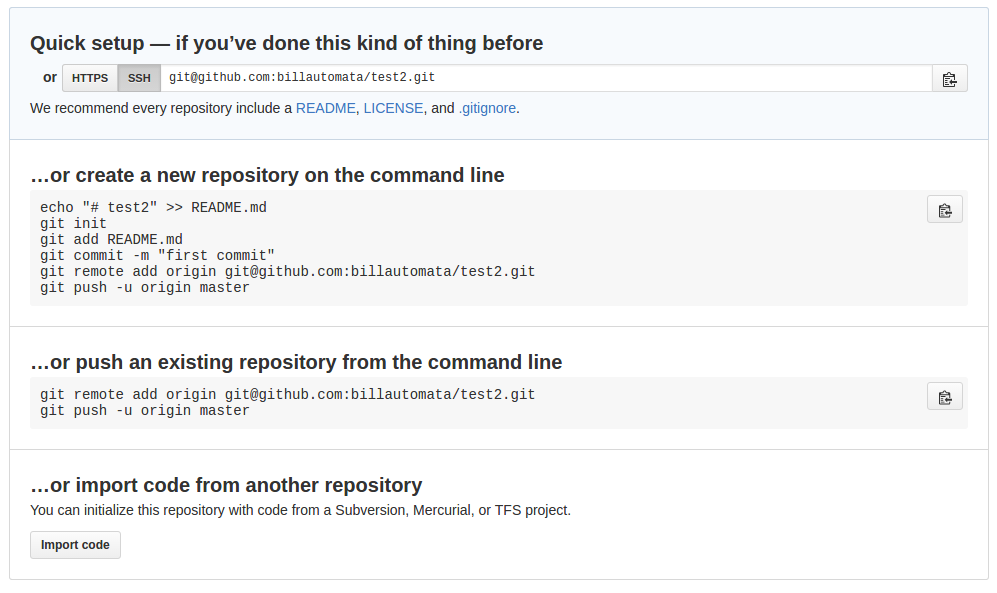

# setting up your environment 

## install [atom editor](https://atom.io/)

## install [nvm](https://github.com/creationix/nvm)
This is the node.js version manager, it lets you install different versions of node.  Older libraries only support legacy versions and sometimes there are bugs unless you are running a highly specific release (ex 4.3.1), it's just something you live with.  It's also nice to check out what's going on in future releases.

## install node v4
`nvm install v4`
We are going to use node.js version 4.

## git basics 
`git` is a program you will use to manage versions of your code. `git` lets you roll back to previous versions and make multiple branches of a single codebase that use different settings.

* Add your SSH key to your github account - [guide](https://help.github.com/articles/adding-a-new-ssh-key-to-your-github-account/)

### initial setup
```bash
# make a new directory 
mdkir my-project
cd my-project

# initialize git in the directory, only do this once
git init

# initialize npm in the directory, only do this once
npm init 

# create an empty file that will hold our code
touch index.js

# add the empty file and the file created by npm, package.json
git add index.js 
git add package.json

# commit the code to the branch (master) with the message "my first commit"
git commit -m 'my first commit'
```
```
# go create a github repository
# do not add a README.md
# get to the point that looks like this
```

```
# take your git remote URL, looks like this - git@github.com:billautomata/my-project.git 
# add the remote URL to your project as the origin
# now when you run "git push" - it sends the data to github, a website

# associate the github website repo with this git project
git remote add origin git@github.com:billautomata/my-project.git

# send the project to the github website
git push -u origin master
```
### when you make big updates and want to save them using git
```
git add index.js 
git commit -m 'pushed elements to array'
git push origin master 
```
## npm basics 
`npm` is the package manager for node.  It is how you install your dependencies and tools for your projects.  Every good node program uses npm in some way.  When you write your own libraries you will use `npm` to manage them.
```
# to install a package 
nvm use 4                             # if you haven't already
npm install --save bignum             # a cool number of doing math with massive numbers
git add package.json                  # running npm install modifies package.json, so you have to track the changes 
git commit -m 'updated dependencies'
git push origin master 
```
## add some code to your `index.js`
```
echo 'console.log(Date.now()' >> index.js
# or 
atom index.js
# and add whatever...
```
## task runner 
A very useful tool is a task runner called `supervisor`.  It watches the files you specify and when it notices changes it restarts the node program.
```
nvm use 4                       # if you haven't already
npm install -g supervisor       
```
The `-g` flag installs the tool as a command line application globally.
```
cd my-project
supervisor -n exit index.js
```
Now when you save `index.js` the program should restart and run again, very handy!  The `-n exit` flag makes the program not restart on exit.
